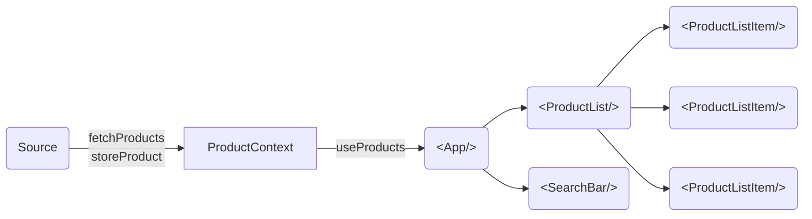

# Live-coding Challenge

#### The "Architecture"

#### Questions / Tasks
1. What do you think about the overall structure? Does it seem to have any particular up- or downsides?
2. How to prevent the click event on ProductListItem's text area from propagating and triggering the click handler on its parent.
3. How many renders will happen in the course of `product-provider.tsx:28 - getProducts()`?
4. How to deal with the API taking pretty much _random_ time to process requests, which can result in responses being handled out of sequence?
5. How to deal with atrocious rendering performance? Hint: most performance is lost during image generation in `<PixelGrid />`. The offending method is called `generateImageDataURL` - it's synchronous (happily blocking main thread for at least 200ms), deterministic and **can not be changed for the purposes of this exercise**.
6. Add debouncing to search input **and** to description inputs.
7. Why does the red "Loading" button (which replaces blue "Clear search" button) transition from blue to red, if it's a separate React node? By design, the transition should happen when "Clear search" button changes states between enabled and disabled. There should be no CSS transition between this button and "Loading..".
8. Feature request: "Add to favourites", but the backend is not ready. There will be a couple of endpoints for this, in the future, but for now, the feature should use memory (or local storage). The idea is to not have to change a lot of code, once the backend support arrives.
